# 1. Computing population genetics summary statistics
A summary of summary statistics
1. $\theta$ (Watterson's estimator) is the number of polymorphic sites/segregating sites
	- $\theta = 4N_e\mu$ assuming infinite loci
2. $\pi$ (heterozygosity) tells us how genetically diverse a population is
3. $d_{xy}$ tells us how genetically differentiated two populations are
4. $F_{st}$ combines $\pi$ and $d_{xy}$ to tell us how much variation is within vs between populations, i.e. differentiation due to population structure
	- allows us to estimate migration rates under Wright's finite island model
5. Tajima's D combines $\pi$ and $\theta$ to tell us if a population is evolving neutrally

Computing $F_{st}$ and $\pi$ using poolgen
```bash
../poolgen/target/release/poolgen heterozygosity \
    -f 'cut_genome_chr.sync' \
    --phen-fname '../Lolium_phenotype_cut.csv' \
    --n-threads 32 \
    --window-size-bp 10000 \
    --window-slide-size-bp 5000 \
    -o 'ws10000/genome_10000_het.csv' &
```
```bash
../poolgen/target/release/poolgen fst\
    -f 'cut_genome_chr_d.sync' \
    --phen-fname '../Lolium_phenotype_cut_for_distance.csv' \
    --n-threads 32 \
    --window-size-bp 10000 \
    --window-slide-size-bp 5000 \
    -o 'ws10000/genome_fst.csv' &
```
> visualize with `plot_het.py` and `plot_fst.py`

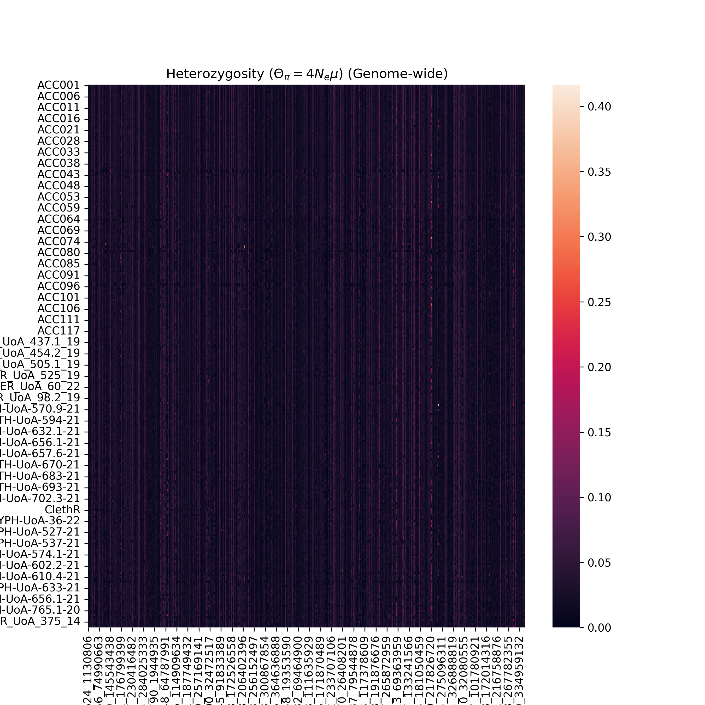
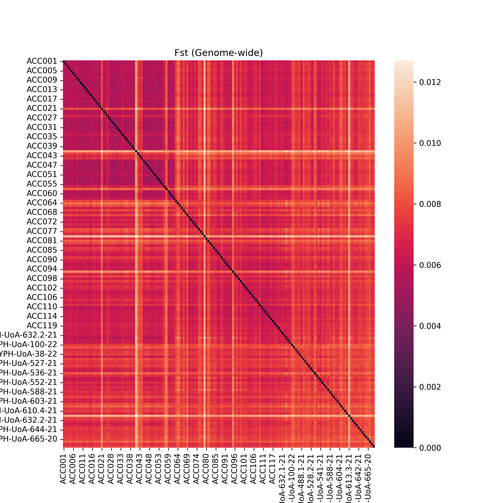

Overall, our ryegrass populations are not too differentiated.

# 2. Identifying structural patterns
We wish to identify structural patterns in our populations to learn more about demographical and evolutionary forces acting on them, as well as test them against what we expect under standard population genetic theory.

#### Hierarchical clustering
For starters, we can conduct a simple hierarchical clustering based on $F_{st}$.
> visualize with `plot_dendrogram.py`

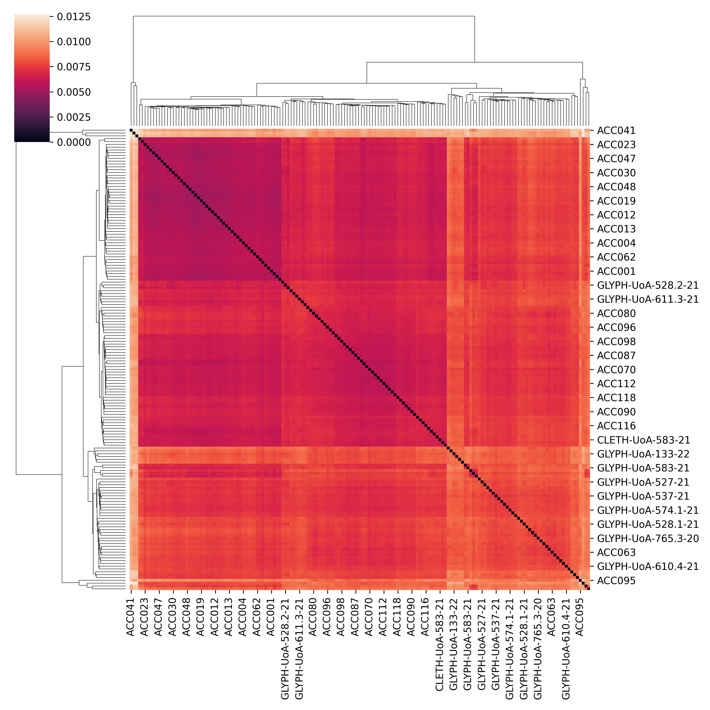

The dendrogram doesn't tell us much more about our pools than the $F_{st}$ matrix did (since it basically just sorts it), but it does tells us that our pools are not in very well defined genetic "clusters".
We can compare this dendrogram to hierarchical clustering based on geographical distance (km), where there are much more distinct clusters (populations of ryegrass are generally collected at hotspots).

To compute an accurate measure of geographical distance, we use the [Haversine formula](https://en.wikipedia.org/wiki/Haversine_formula)
> compute distances using `rust_utils/orthodromic_distance`

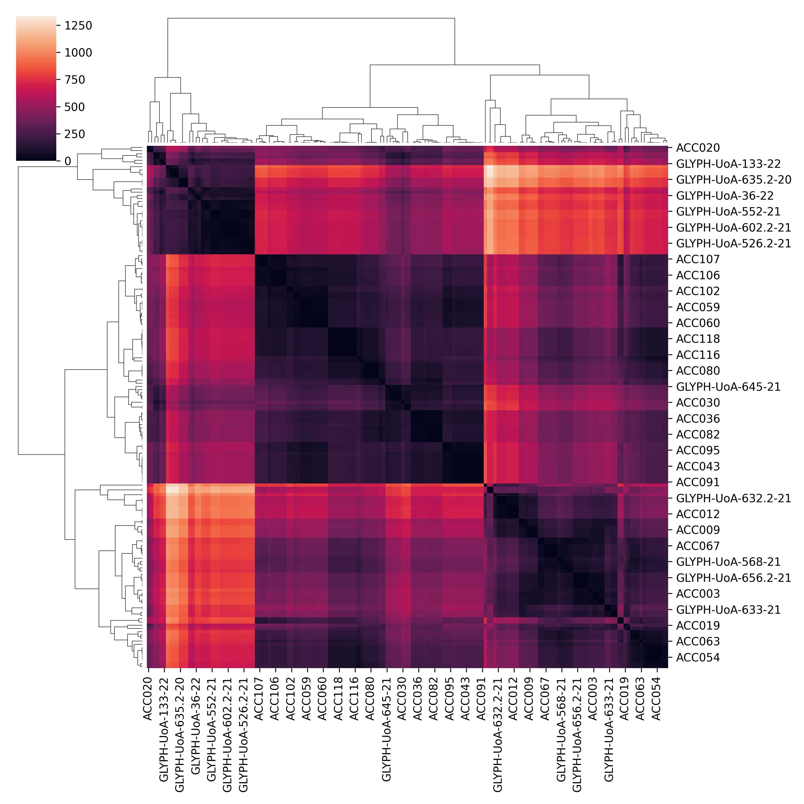

### Isolation by distance
Using our distance values, we can also test isolation by distance. We expect to see that genetic differentiation increases with increasing geographical distance - among our populations. This is because of an expected decrease in dispersal of gametes/gene flow for populations further apart.

We can test this hypothesis by computing correlation statistics between our two measures of distance.

For this analysis, only 167 of our 246 pools will be used, since the rest do not have coordinate data.

#### Mantel test
Since both $F_{st}$ and geographical distances are $n \times n$ distance matrices, a reasonable and useful test for correlation is the mantel test. ([Legendre P and Fortin MJ 2010](https://doi.org/10.1111/j.1755-0998.2010.02866.x))
> compute mantel statistic using `mantel_t.py`

We get an r-value of $0.1175$ and a p-value of $0.01$, showing a statistically significant positive correlation between geographical distance and $F_{st}$ and supporting isolation by distance.

#### Mantel test across windows
Instead of just conducting a mantel test using genome-wide mean $F_{st}$, we can conduct a mantel test for each window individually.
This allows us to isolate windows that don't follow isolation by distance, which may indicate sites of notable resistance genes.
> compute mantel statistic across windows using `mantel_t_windows.py`

A p-value threshold for non-significantly correlated windows can be empirically determined by taking the top 5% of p-values for a two tailed mantel test.
Then, these sites can be subject to further functional analysis.

#### Linear regression
Another way to test for correlation between $F_{st}$ and geographical distance is to collapse the $n \times n$ matrix into a 1D array of pairwise distances to conduct a simple linear regression analysis. 
There are problems with using a linear regression here, since observations are not independent (many distances depend on the same coordinate data), but it may still be useful and we can remove redundancy by flattening the matrix.
This flattened array removes symmetric pairs (AxB is the same as BxA) and is of length $\frac{n \times (n-1)}{2}$

This allows us to isolate specific pairs of pools that support/do not support isolation by distance.
> visualize using `plot_fst_vs_dist.py`

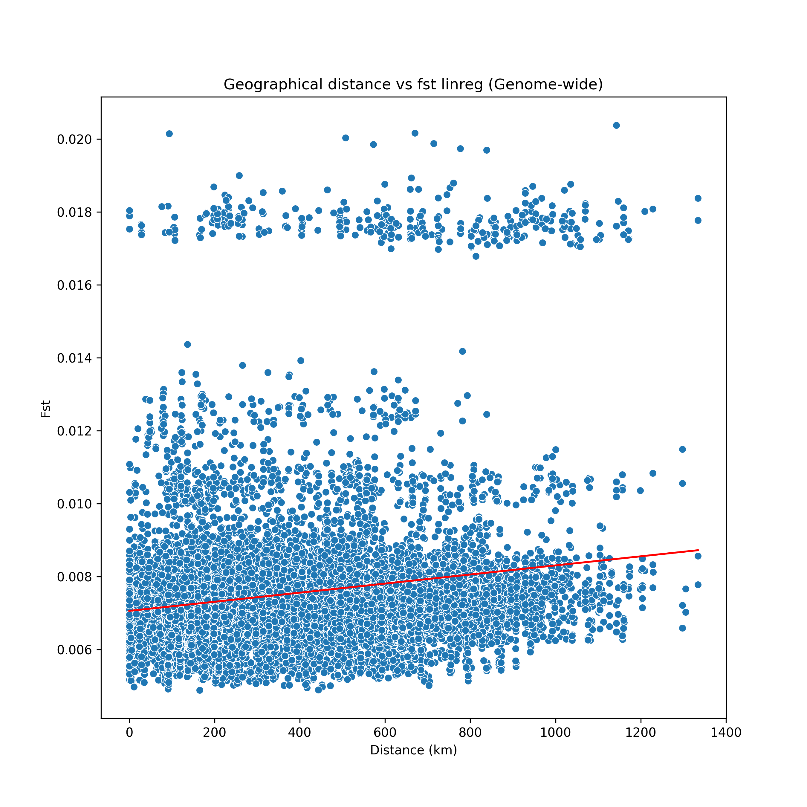

From the linear regression, we reinforce our result from the mantel test - supporting isolation by distance.

However, while most of the pools are clustered below, we also see some sort of structural separation, with a very clear upper cluster with higher $F_{st}$ a less well defined middle cluster.

#### Linear regression clusters
We can separate the clusters (by eyeball analysis) and conduct separate linear regressions for each of the clusters.
> visualize using `plot_fst_vs_dist_clusters.py`

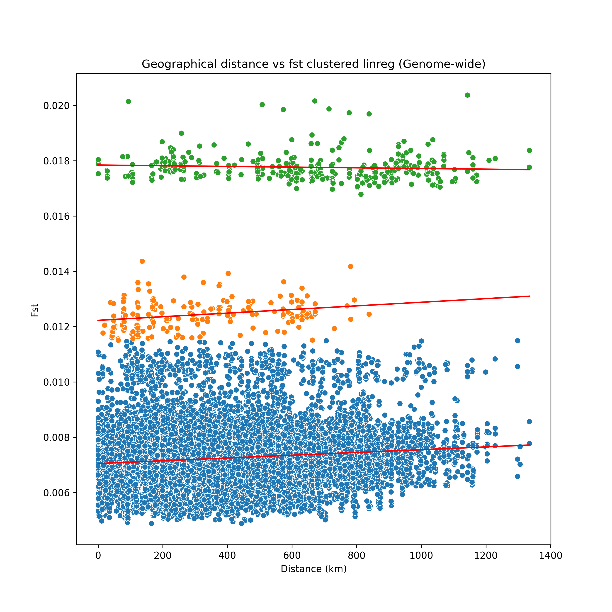

While the middle cluster is still positively correlated, the upper cluster is no longer significantly correlated in either direction. This could indicate something evolutionary interesting such as selection for the same traits reducing genetic differentiation between distant populations or barriers to dispersal increasing genetic differentiation between nearby populations.
In order to know why these clusters exist, we need to first identify which pools are represented in each cluster.

Each pool appears 167 times in the data set, since each pool has one matching with each other pool. We can count the frequency of each pool's appearance in each cluster.
For each pool, our null expectation for how often we would expect it to appear can simply be the proportion of the total number of points in each cluster. This will be indicated by a red line.
> visualize using `plot_fst_vs_dist_clusters_freq.py`


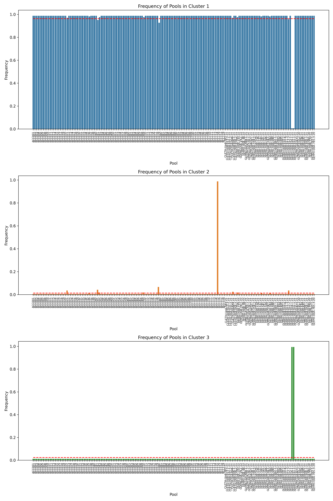

From this, we can clearly see that our clusters are caused by only a couple of pools.
They are: ACC115 in the middle cluster, and GLYPH-UoA-616.1-21 and GLYPH-UoA-632.1-21 in the upper cluster.

# 3. Comparative mapping of outlier pools
One possible explanation for the outlier pools is a misclassification of another species such as *Lolium perenne* or *Lolium multiflorum* as *Lolium rigidum*. It could be that the bottom cluster is actually of the species *Lolium perenne*, and the middle cluster is a hybrid of *Lolium rigidum* and *perenne*.

This can be evaluated with a comparative mapping of our sequence reads against the respective reference genomes using the Burrows-Wheeler aligner.

These were the reference genomes used: 
[Rigid ryegrass genome](https://doi.org/10.3389/fgene.2022.1012694)
[Annual ryegrass genome](https://www.ncbi.nlm.nih.gov/datasets/genome/GCA_019182485.1/)
[Perennial ryegrass genome](https://www.ncbi.nlm.nih.gov/datasets/genome/GCA_019359855.2/)

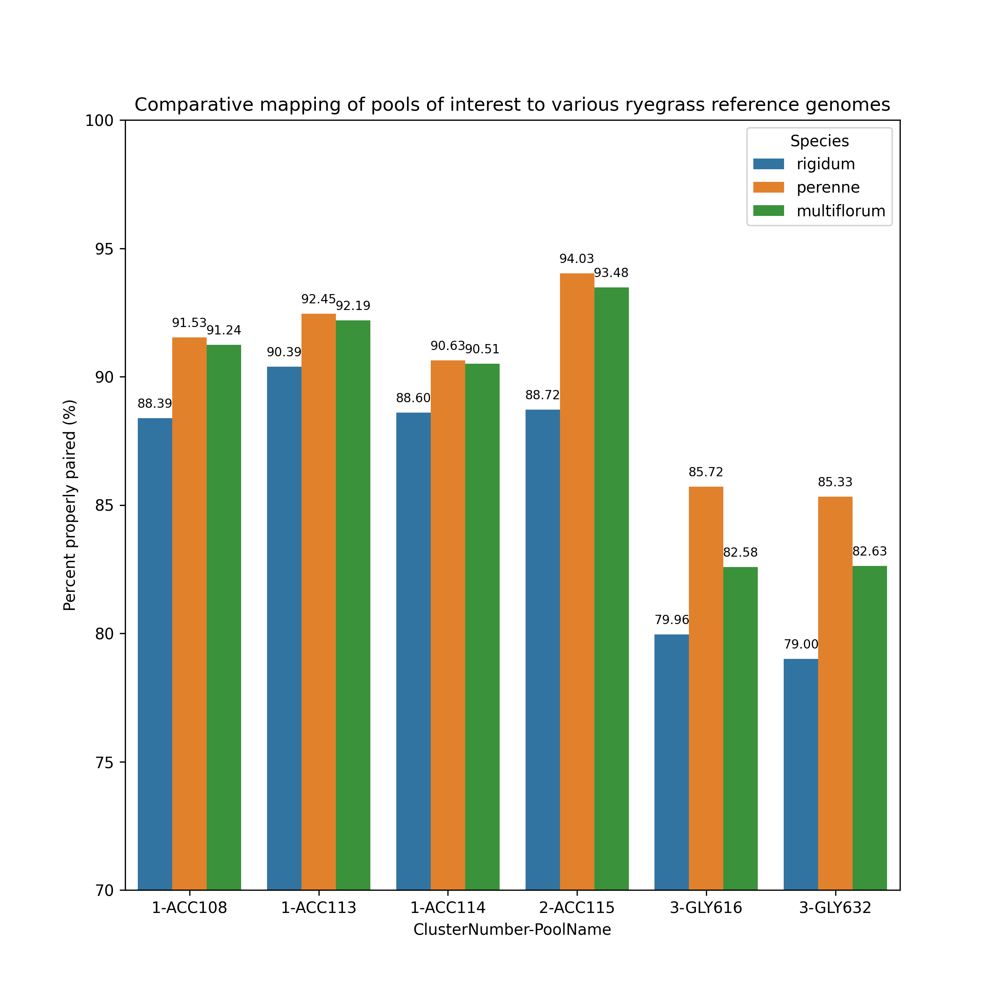

Unfortunately, while our mapping reflects what we already know from our summary statistics - that the outlier pools are significantly more differentiated from the rest of our data - we were unable to identify a reference genome that mapped better to the outlier pools.
Either way, the fact that these pools are outliers is helpful in the next step - identifying modes of convergent evolution - in that we now know to exclude them from the analysis.

# 4. A few more visualizations
#### Linear regression with glyphosate resistance as hue (without our outlier populations)
> visualize with `plot_fst_vs_dist_phen.py`

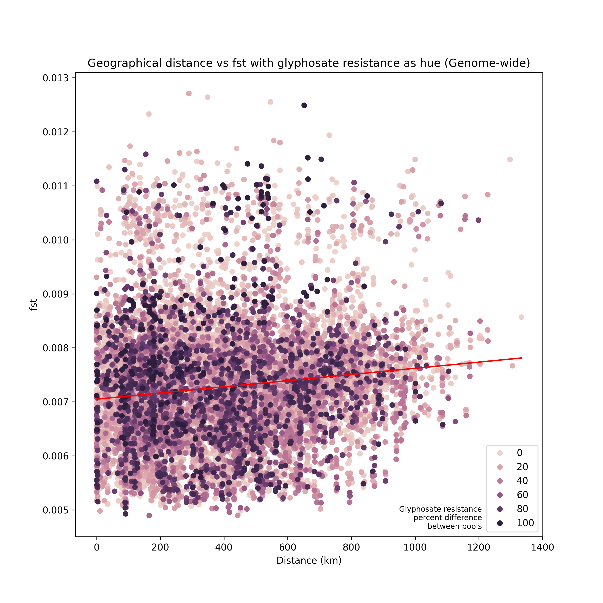

#### Heterozygosity vs glyphosate resistance
> visualize with `plot_het_vs_phen.py`

We should expect to see decreasing heterozygosity with increasing glyphosate resistance as selective sweeps and hitchhiking reduce genetic diversity near allelic sites.
Since selection for glyphosate resistance is strong, a tight genetic bottleneck is created that drives down diversity in resistant populations.

However, if glyphosate resistance is a highly polygenic and quantitative trait, and selection for glyphosate resistance is not as strong as expected (perhaps highly variable dosages of glyphosate), heterozygosity could increase with glyphosate resistance too.

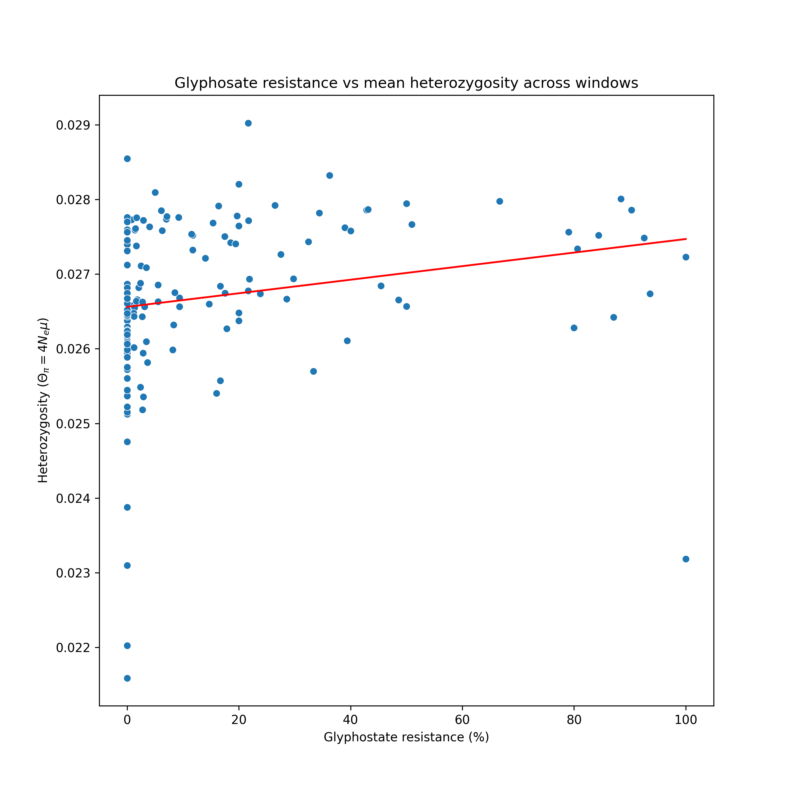


#### Variance of heterozygosity for different window sizes.
This was originally computed to allow for a way to determine the optimal window size for computing summary statistics that reduced noise while keeping definition. Since then, a cubic spline method [Beissinger et al. 2015](https://doi.org/10.1186/s12711-015-0105-9) was used in its replacement.
>visualize with `plot_windowsize_variances.py`

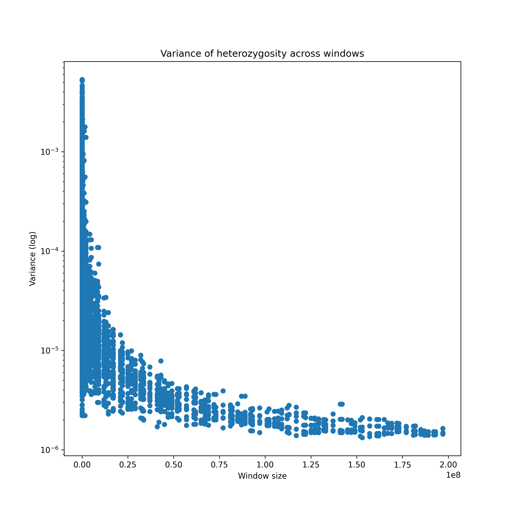
