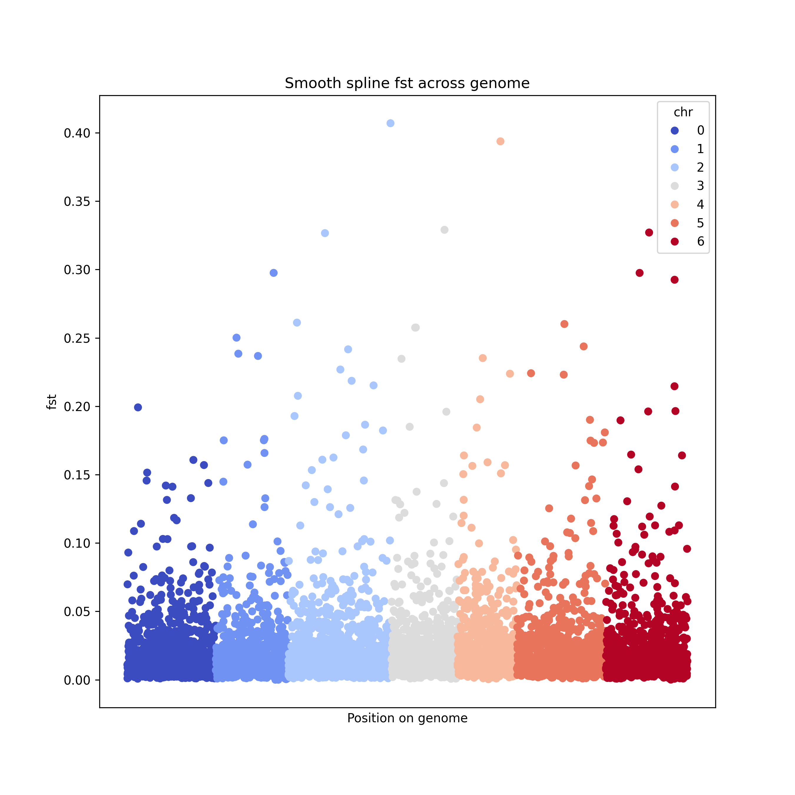
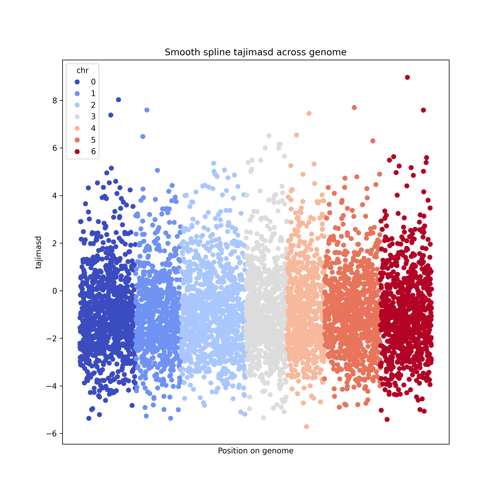

[Beissinger et al. 2015](https://gsejournal.biomedcentral.com/articles/10.1186/s12711-015-0105-9) provides a novel method for choosing windows for computing summary statistics like $F_{st}$ that previously was arbitrarily chosen or weakly justified.

The method relies on fitting a cubic smooth spline to the data computed first at each locus, then taking the inflection points to be window boundaries. This method has a higher discovery rate and minimizes false positives.

Since gudmc relies on overlapping $F_{st}$ and Tajima's D to identify genomic signatures, windows for the two statistics must be the same. We will first use $F_{st}$ between two pools to identify windows, then compute all other summary statistics using these windows. This also means only two pools will have the same windows and it is only meaningful to compare two pools at any given time.

We will focus on ACC001 (fully susceptible) and ACC041 (fully resistant)

First, compute $F_{st}$ per locus
```bash
../../poolgen/target/release/poolgen fst \
    -f ACC001_vs_ACC041.sync \
    --phen-fname phen_ACC001_vs_ACC041.csv \
    --min-loci-per-window 1 \
    --window-size-bp 1 \
    --window-slide-size-bp 1 \
    --n-threads 32 \
    -o fst/ACC001_vs_ACC041_fst.csv &
```
```bash
../../poolgen/target/release/poolgen tajima_d \
    -f ACC001_vs_ACC041.sync \
    --phen-fname phen_ACC001_vs_ACC041.csv \
    --min-loci-per-window 1 \
    --window-size-bp 1 \
    --window-slide-size-bp 1 \
    --n-threads 32 \
    -o ACC001_vs_ACC041_tajimasd.csv &
```

> compute spline windows and spline $F_{st}$ using `compute_spline_fst.py`
> compute corresponding spline Tajima's D using `compute_spline_tajimasd.py`

However, this method still captures some of the noise from computing summary statistics per loci. This leads to many small windows that poolgen would have filtered out. 
We can set a window size threshold (i.e. 30) to remove these.

> plot each using `plot_spline.py`




These summary statistic estimates can now be used in gudmc.